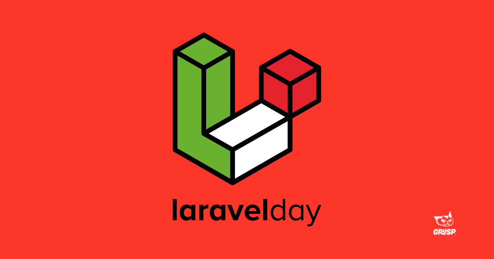

# Laravel@127.0.0.1 2021

24 settembre 2021 @ localhost

laravelday è la conferenza italiana dedicata a uno dei framework più utilizzati per PHP, uno strumento molto potente, che ha portato molta innovazione nell'ambiente.
Organizzata ogni anno a partire dal 2017, laravelday vuole dare una panoramica su questa tecnologia e su tutto il suo ecosistema, e permettere alla community di developer laravel di incontrarsi e condividere esperienze e buone pratiche.

L'edizione 2021 di laravelday si svolge il 24 Settembre, online, nel formato '@localhost'.

## Pillole digeribili di Sicurezza

Buone pratiche, package, idee e suggerimenti per mettere in sicurezza il proprio applicativo a livello strutturale e cercare di dormire più tranquilli.

Simuliamo una pagina web in cui l'utente deve registrare un documento di riconoscimento. Poniamo l'esempio quindi in cui l'utente deve salvare un dato in chiaro (ad esempio il tipo di documento, scusate la poca fantasia) e il numero di documento (questo invece sarà un dato protetto).

Le informazioni riguardanti i modelli e il DB si trovano alla [pagina dedicata](design/database.md).

### Librerie Utilizzate

- [RichardStyles/EloquentEncryption](https://github.com/RichardStyles/EloquentEncryption): utilizzato per consentire un ulteriore livello di sicurezza durante la gestione dei dati sensibili. Consente ai campi chiave dei tuoi modelli di essere crittografati. Questa libreria non utilizza la libreria di [default di laravel](https://laravel.com/docs/8.x/encryption), quindi non utilizza app:key.
- [graham-campbell/throttle](https://github.com/GrahamCampbell/Laravel-Throttle): Utilizzato per evitare di sovraccaricare le richieste. Utilizzato soprattuto nella API.
- [laravel-surveillance](https://github.com/neelkanthk/laravel-surveillance): Utilizzato per mettere sotto sorveglianza utenti malintenzionati, indirizzi IP e impronte digitali del browser anonime, scrivere registri di sorveglianza e impedire a quelli malintenzionati di accedere all'app.
- [enlightn/security-checker](https://github.com/enlightn/security-checker): Utilizzato per il controllo di presenza package con falle di sicurezza.
- [RichardStyles/eloquent-aes](https://github.com/RichardStyles/eloquent-aes): Altro componente che permette di criptare i dati a db con metodo AES.    

### Utilizzo dei comandi da CLI

## License

The Laravel framework is open-sourced software licensed under the [MIT license](https://opensource.org/licenses/MIT).
